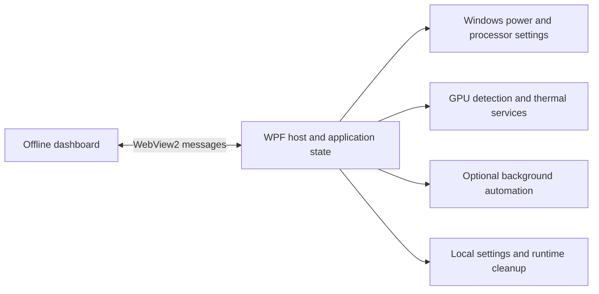

# GSwitcher

**A portable Windows control dashboard built around a real laptop's power, thermal, and everyday workflow needs.**

Created by [Khaled Alrefai](https://github.com/Kaldx5). Designed around a Dell G16 environment, with a C# desktop host and an offline HTML/CSS/JavaScript interface.

## Why I built it

Switching between performance, quiet everyday use, and battery operation meant navigating scattered controls and hardware-specific behavior. GSwitcher brings those decisions into one compact interface, with explicit feedback from Windows rather than assuming a requested change succeeded.

This project connects interface design, Windows integration, hardware investigation, and iterative implementation. It represents how I work: understand the problem, research the constraints, design a solution, direct implementation, and review the result.

## What is inside

| Area | Implementation |
| --- | --- |
| Power modes | Discover installed plans, request a switch through `powercfg`, and verify the active mode. |
| Processor controls | Discover processor settings and validate AC/DC edits against Windows-reported values. |
| Thermal tools | Diagnostics, cooling profiles, and a bounded CPU calibration workload. |
| GPU visibility | Read-only dashboard route indicators; separate NVIDIA policy actions when supported. |
| Everyday automation | Optional startup, quick-switch OSD, idle and lid behavior, battery protection, microphone muting, network focus, and telemetry HUD. |
| Interface | Offline WebView2 dashboard, light/dark themes, tray integration, and local settings. |

The source also includes Dell WMI and NVIDIA Control Panel route controllers. Their presence does **not** mean route switching is available through the dashboard or supported on every machine. See [operating boundaries](docs/OPERATING_BOUNDARIES.md).

## My contribution and AI-assisted workflow

I led the problem framing, research, planning, design direction, technical decisions, and iterative review. I used coding assistants and agents to accelerate implementation, then inspected their outputs, directed corrections, and made manual changes where needed.

I do not claim to have manually typed every line. My contribution is in turning an everyday problem into an integrated system and taking ownership of the decisions and development process.

Two decisions illustrate that approach:

- **Verify the resulting state:** the power interface reports the active Windows scheme after a switch, instead of treating a button press as success.
- **Separate observation from control:** dashboard GPU indicators are read-only; hardware-specific controllers and policy actions have separate availability checks.

## Architecture



## Build from source

Windows x64, .NET Framework 4.8 development/build components, Windows PowerShell, and the Microsoft Edge WebView2 Runtime are required. The build script uses Windows Framework MSBuild and expects WPF build targets to be installed.

```powershell
.\scripts\restore_packages.ps1
.\build_portable.ps1
```

Run `dist\GSwitcher\GSwitcher.exe`. Dependency restoration requires internet access; the dashboard assets themselves are offline. The original package versions are pinned: WebView2 **1.0.2420.47**, NvAPIWrapper.Net **0.8.1.101**.

The builder replaces this checkout's generated `dist/GSwitcher` directory and preserves any existing settings there. Build from your own checkout rather than inside an installed copy.

## Checks

```powershell
.\scripts\verify_automation_pack.ps1
# Optional startup/exit check after building:
.\scripts\smoke_test.ps1
```

The first script checks source structure and expected implementation patterns; it is not a hardware integration test. The smoke script launches the app and checks startup, exit, and runtime cleanup. See [publication checks](docs/PUBLICATION_CHECKS.md) for the checks actually completed on this source snapshot.

## Repository layout

- `source/GSwitcher.Desktop/` — desktop host, services, models, and offline UI.
- `scripts/` — dependency restoration and selected verification tools.
- `docs/` — operating boundaries, dependency attribution, and publication notes.
- `build_portable.ps1` — portable build; `build_pro.ps1` — compatibility wrapper.

This repository publishes the application source, not the original development archive. Agent conversations, machine diagnostics, personal settings, nested copies, and prebuilt binaries are excluded.

## Author

[GitHub](https://github.com/Kaldx5) · [LinkedIn](https://www.linkedin.com/in/khaled-alrefai-668079273/)

Source is published for inspection and portfolio presentation. No open-source license is granted for original project code at this stage; third-party components retain their own licenses. See [third-party notices](docs/THIRD_PARTY_NOTICES.md).
